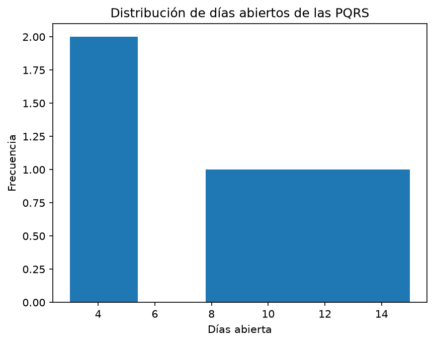
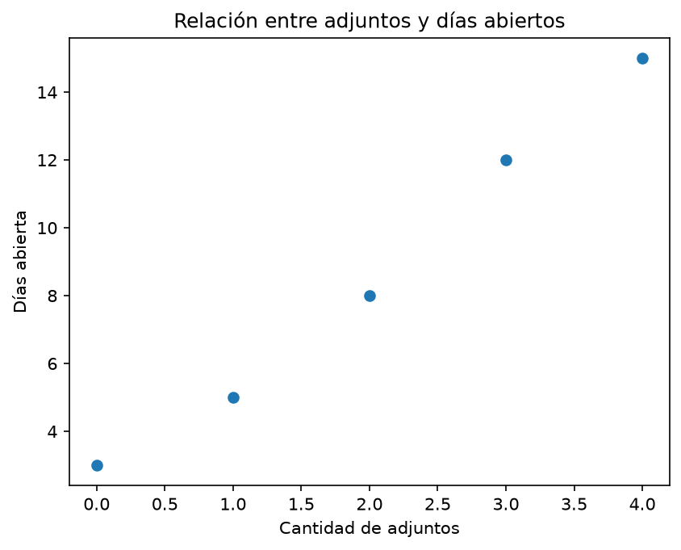

# Curso de Inteligencia Artificial

Repositorio académico para desarrollar las actividades del curso de Inteligencia Artificial y el proyecto **Resuelve**, una propuesta orientada al análisis de Peticiones, Quejas, Reclamos y Sugerencias (PQRS).

## Objetivo del proyecto

Aplicar Python, análisis de datos e Inteligencia Artificial para procesar información de PQRS, identificar patrones y generar resultados que apoyen su gestión y priorización.

Los datos utilizados actualmente son simulados y no contienen información real de usuarios.

## Tecnologías

- Python 3
- CSV y Markdown
- Pandas#
- Docker y Docker Compose
- Git y GitHub
- Visual Studio Code

## Estructura principal

```text
CursoIA/
├── Clase 1/
│   └── proyecto_resuelve_ia.md
├── Clase 2/
│   ├── analisis_de_datos.py
│   ├── informe_proyecto.md
│   └── investigacion_proyectos.md
├── Clase 3/
│   ├── analizar_cultivos.py
│   ├── cultivos.csv
│   ├── informe_cultivos.md
│   ├── datos.txt
│   ├── cultivos.json
│   └── ejercicios de lectura, escritura y excepciones
├── src/
│   ├── analisis_pqrs.py
│   ├── analisis_proyecto.py
│   ├── cargar_datos.py
│   ├── gestion_pqrs.py
│   └── main.py
├── Dockerfile
├── docker-compose.yml
└── requirements.txt
```
## Análisis Exploratorio de Datos

Para la Clase 4 se realizó un Análisis Exploratorio de Datos (EDA) sobre el archivo `data/pqrs/pqrs.csv`, utilizando NumPy y Matplotlib.

### Variables analizadas

Se seleccionaron dos variables numéricas relacionadas con la gestión de PQRS:

- `dias_abierta`: cantidad de días que una PQRS permanece abierta.
- `cantidad_adjuntos`: cantidad de archivos adjuntos asociados a cada PQRS.

### Estadísticas descriptivas

Para la variable `dias_abierta` se obtuvieron los siguientes resultados:

- Media: 8.60 días.
- Mediana: 8.00 días.
- Desviación estándar: 4.41 días.
- Mínimo: 3 días.
- Máximo: 15 días.

Para la variable `cantidad_adjuntos`:

- Media: 2.00 adjuntos.
- Mediana: 2.00 adjuntos.
- Desviación estándar: 1.41.
- Mínimo: 0 adjuntos.
- Máximo: 4 adjuntos.

### Visualizaciones

El análisis genera dos gráficos:



- `data/eda/histograma_dias_abierta.png`: muestra la distribución del tiempo que permanecen abiertas las PQRS.


- `data/eda/dias_vs_adjuntos.png`: muestra la relación entre la cantidad de adjuntos y los días que permanece abierta cada PQRS.

### Patrones y relaciones encontradas

En el conjunto de datos utilizado se observa que las PQRS con mayor cantidad de archivos adjuntos también presentan una mayor cantidad de días abiertas.

El coeficiente de correlación entre `cantidad_adjuntos` y `dias_abierta` es aproximadamente `0.9943`, lo que representa una relación positiva muy fuerte dentro de este conjunto de datos.

Sin embargo, los datos utilizados son sintéticos y el conjunto contiene únicamente cinco registros. Por esta razón, esta correlación no permite concluir que la cantidad de adjuntos sea la causa de un mayor tiempo de atención. El resultado debe considerarse como un patrón inicial que podría verificarse posteriormente utilizando un conjunto de datos más amplio.

### Relación con el futuro modelo de Inteligencia Artificial

El análisis exploratorio permite identificar variables que podrían ser útiles para un futuro modelo de Inteligencia Artificial orientado a la gestión y priorización de PQRS.

Variables como el tiempo de apertura, la cantidad de adjuntos, el tipo de solicitud y el estado podrían utilizarse posteriormente para identificar patrones, clasificar solicitudes o estimar cuáles PQRS pueden requerir mayor atención.

Antes de construir un modelo predictivo será necesario disponer de una mayor cantidad de registros y evaluar otras variables relevantes del proceso de gestión de PQRS.